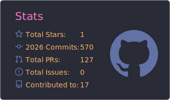
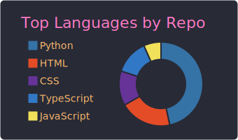

# Hi 👋! My name is Jose Luiz Bruiani Barco and I'm a Fullstack Developer

|            Stats Graph             |            Languages Graph             |
| :--------------------------------: | :------------------------------------: |
|  |  |

## Techs

<!-- TECHS:START -->

<!-- TECHS:END -->

## About Me

### [My Portfolio](https://portfolio-jlbbarco.vercel.app)

### Contact-me

<!-- CONTACT:START -->

<!-- CONTACT:END -->
